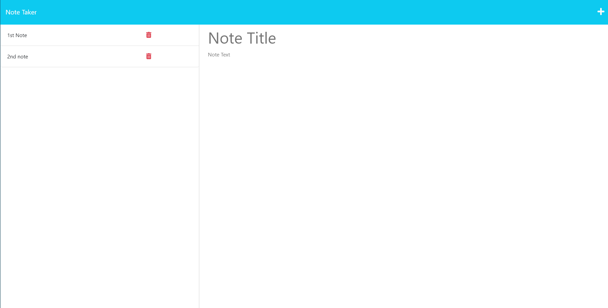

# Note Tracker 📝

## Description

This application utilizes an Express.js back-end to allow users to write, save, read, and delete notes.

## Table of Contents
  * [Criteria](#criteria)
  * [Screenshots](#screenshots-of-application)
  * [Heroku Deployment](#heroku-deployment)
  * [Questions](#questions)

## Criteria

  * A notes page that shows existing notes listed on the left hand side
  * When you enter a new note and save it, it will appear on the left hand side with previously saved notes

The following applies to HTML routes:
  * `GET /notes` should return the `notes.html` file.
  * `GET *` should return the `index.html` file.

The following applies to API routes:
  * `GET /api/notes` should read the `db.json` file and return all saved notes as JSON.
  * `POST /api/notes` should receive a new note to save on the request body, add it to the `db.json` file, and then return the new note to the client.

## Screenshots of Application

Screenshot of the Home Page

Screenshot of the Application Page

Screenshot of 2 notes created and saved on the left hand side

Screenshot of the 2 saved notes in the db.json file

## Heroku Deployment

[Deployed Application on Heroku]()

## Questions

For any further questions, you can reach the author of this project at https://github.com/scostemal or by email at scott.malone62@gmail.com.